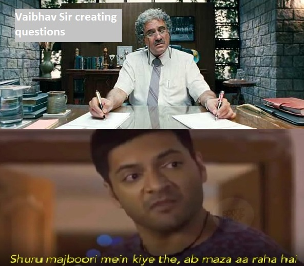

### Loops Practice Questions
1. Write a program to sum all the entered value until user enter 0 to stop.
2. Write a program to check all the values entered by user, if the entered value is even print, if the entered value is odd print odd, if the entered value is 0 stop.
3. Write a program to print the sum of all the even values entered by user until user enter 0 to stop.
4. Write a program to calculate sum of all the values entered also count the number of values entered by user, stop when user enter 0. Print the sum of the values and count.
5. Write a program to print numbers starting form 1 to 20.
6. Write a program to print all the odd number form 1 to 20. Hint check i % 2 != 0 and print i if it is odd.
7. Write a program which accept a magic number form the user, print winner and stop if user entered magic number. In this particular question magic number is the question number. `:-)`
8. Write a program which accept a magic number form the user, print winner and stop if user entered magic number otherwise print try again. Also stop when user enter 0. In this particular question magic number is the question number. `:-)`
   
 



9. Write a program to print all the numbers divisible by 5, from 1 to 100.
   ```
   Sample output
   5 10 15 20 25 30 35 40 45 50 55 60 65 70 75 80 85 90 95 100 
   ```
10. Write a program which accepts the starting point and end point from the user and print the sum of all the values between the starting point and end point. Starting point is inclusive and end point is exclusive.
     ```
    Sample run
    enter the starting point - 10
    enter the end point - 15
    sum = 60
   
    Explaination:
    sum all the values between 10 to 15, as starting point is inclusive 
    10 + 11 + 12 + 13 + 14
    15 is not considered for sum as loop must iterate < 15
    so the result is 60
    
    Hint:
    - i should be initialized with stating point 
    - i should be less than end point
    ```
11. Write a program which accepts the starting point and end point from the user and print the sum and count of all the even values between the starting point and end point. Starting point and end point both are inclusive.
     ```
    Sample run
    enter the starting point - 10
    enter the end point - 20
    sum = 90
    count = 6
   
   
    Explaination:
    sum all the even values between 10 to 20, as starting point and end point both are inclusive 
    10 + 12 + 14 + 16 + 18 + 20
    so the result is 90, and count is 6
    ```